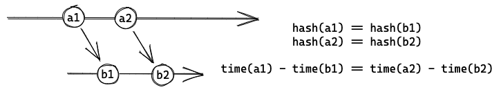
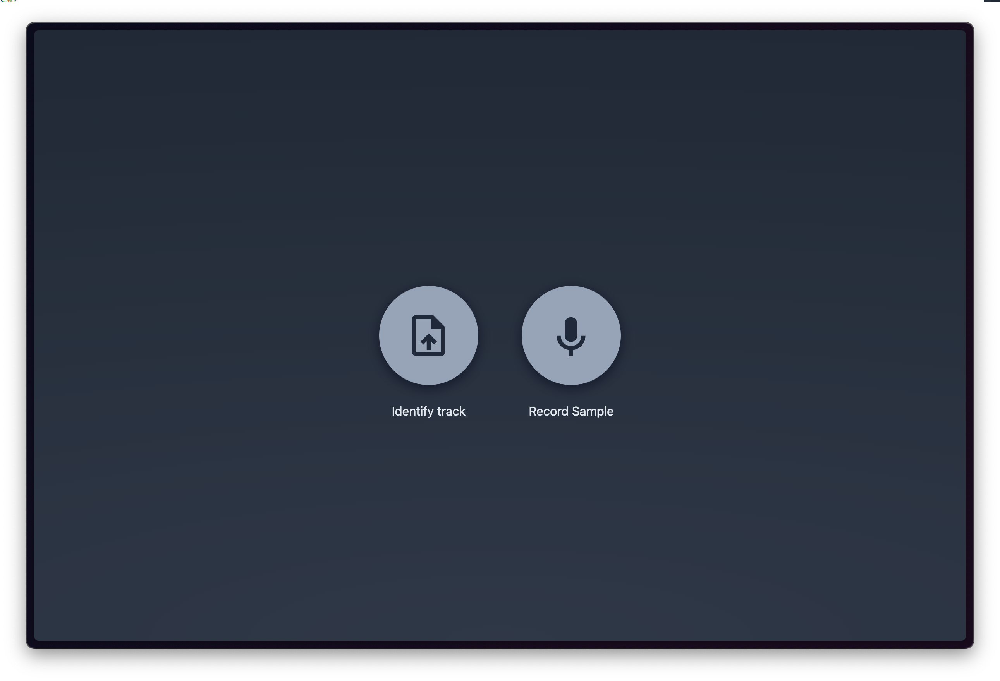
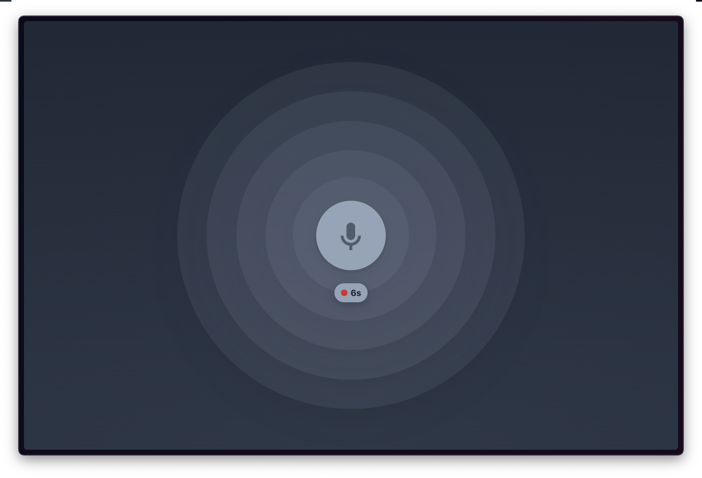
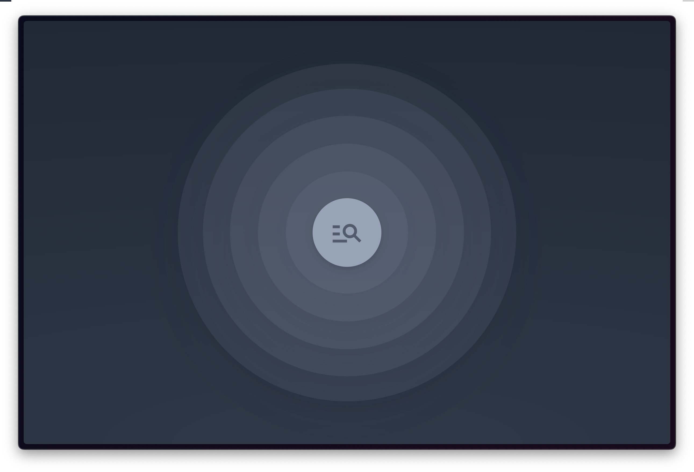
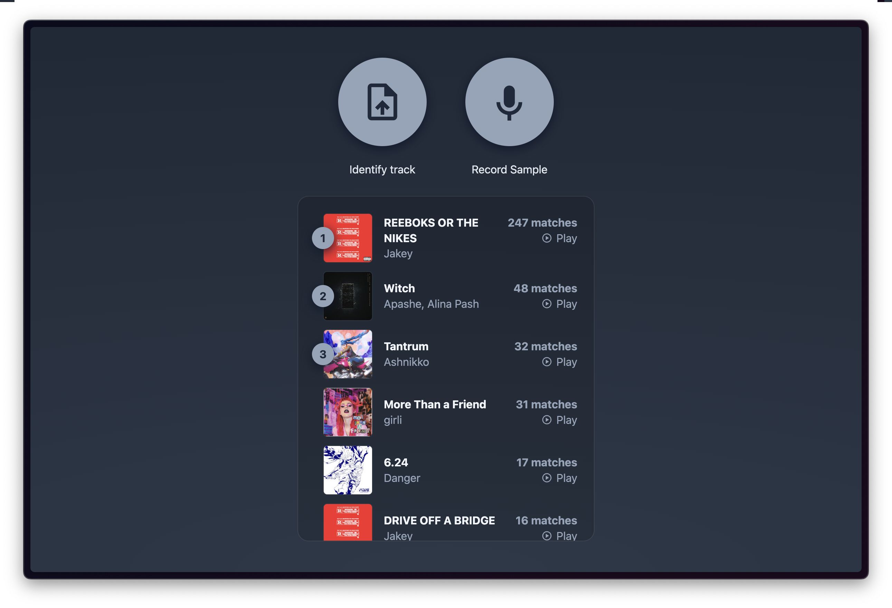
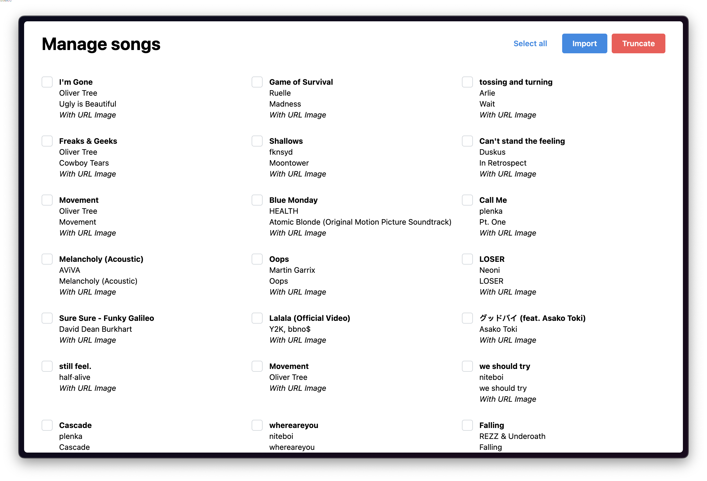

# Obecná audio podobnost (NI-VMM)

Aplikace je k dispozici na této adrese: [https://vmm.duong.cz](https://vmm.duong.cz).

## Popis projektu

Projekt je zaměřen na implementaci podobnostní míry pro audio skladby. Aplikace by měla obsahovat databázi audio souborů. Uživatel se následně může dotázat vlastním audio dotazem (skrze webové rozhraní) do databáze a aplikace vrátí množinu podobných audio souborů v databázi. V rámci projektu je třeba
naimplementovat extrakci deskriptorů ze zvoleného typu audio souborů a navrhnout a implementovat na nich vlastní podobnostní míru.

Vstup: Audio soubor.

Výstup: Množina databázových audio souborů podobných vstupnímu audiu setříděných podle podobnosti s možností jejich přehrání.

Aplikace by měla obsahovat části:

- Modul extrakce deskriptorů z audia
- Modul podobnostní míra pro porovnání dvojice audio souborů, tj. jejich deskriptorů
- Modul identifikace podobných databázových audio záznamů s ohledem na vstupní audio
- Webový interface

## Způsob řešení

Náš způsob extrakce deskriptorů a jejich následné porovnání je inspirováno aplikací Shazam.

Nejprve přečteme WAV audio soubor a downsamplujeme z 44,100 Hz na 11,050 Hz, s cílem potlačit vliv šumu na výsledek. Následně získaneme spektrogram pomocí krátkodobé Fourierové transformace (Short-Time Fourier Transformation), který analyzuje signál po krátkých časových úsecích. Vzniklý spektrogram rozdělíme na jednotlivé pásma frekvencí: 0-250 Hz, 250-520 Hz, 520-1,450 Hz, 1,450-3,500 Hz, 3,500-5,512 Hz.

Pro zjednodušení chceme ze spektrogramu se spoustou frekvencí o různých intenzitách získat pouze ty frekvence, které jsou pro nás nejdůležitější metodou [`bands`](/research/freq/bands.py): pro každý časový úsek a každé pásmo si vybereme nejintenzivnější frekvenci. Vybereme však pouze frekvence, které mají větší intenzitu než klouzavý průměr vybraných intenzit. Tím dostaneme tzv. peak frequencies. Alternativně jsme v metodě [`prominence`](/research/freq/prominence.py) použili vestavěnou metodu `scipy.signal.find_peaks`, která nalezne lokální maxima a vybere je podle nejvyšší prominence.

Vzniklé "peak frequencies" poté seřadíme vzestupně nejprve podle času výskytu a poté podle frekvence. Po jejich seřazení jsme schopni seskupit frekvence do posloupnosti za účelem zvýšení entropie při vyhledávání. V této práci jsme implementovali 2 metody seskupení: [`fanout`](/research/hash/fanout.py), kdy kombinatoricky generujeme páry s rostoucím offsetem a metoda [`cluster`](/research/hash/cluster.py), který posouvá okénko nad seřazenými "peak frequencies." Samotnout posloupnost a čas výskytu první frekvence v posloupnosti pak tvoří tzv. otisk audio nahrávky. Tyto otisky posléze nahráváme do databáze.

Tento postup uděláme pro celý dataset skladeb při nasazení aplikace. Jakmile přijde soubor na vstupu, tak ho zpracujeme stejným způsobem a porovnáme jeho otisky s našimi v databázi. Zároveň využíváme toho faktu, že pro jednu skladbu budou mít páry otisků stejný relativní časový posun. Počet takto shodujících otisků pak bereme jako míru podobnosti mezi vstupem a danou skladnou z datasetu.



## Implementace

Celé porovnávaní je implementováno v Pythonu verze 3.9 za pomocí těchto knihoven:

- [librosa](https://librosa.org/doc/latest/index.html) pro práci s audiem,
- [NumPy](https://numpy.org/) pro vektorizované matematické operace,
- [SciPy](https://scipy.org) pro konkrétní implementaci metody [`prominence`](/research/freq/prominence.py).

Spouštění Python skriptu probíhá skrze Node.js funkci [child_process.spawn](https://nodejs.org/api/child_process.html#child_processspawncommand-args-options) pro spouštění procesů.

Webové rozhraní je React aplikace využívající [Create-T3-app](https://create.t3.gg/).

Pro ukládání hashů a metadat o skladbách používáme knihovnu [Prisma](https://www.prisma.io/) a [PostgreSQL](https://www.postgresql.org/).

## Spouštění

Pro zprovoznení doporučujeme použít připravený `docker-compose.yml`, který spolu s aplikací nastaví i databázi. Samotný dataset není součástí zdrojového kódu a bude nutné si jej připravit zvlášť. Aplikace bude vyhledávat skladby a jejich příslušné metadata ve složce [`/dataset`](/dataset).

Metadata skladeb (název skladby, autoři, obrázky, apod.) se získavají přečtením souboru [`/dataset/index.json`](/dataset/index.json) s následující strukturou:

```json
[
  {
    "filename": "[název souboru]",
    "title": "REEBOKS OR THE NIKES",
    "artists": [{ "name": "Jakey" }],
    "album": { "name": "ROMCOM" },
    "thumbnails": [
      {
        "url": "https://lh3.googleusercontent.com/xm-Ex3VSqwICoAB4gSGNtKiCETfh_lJ6_dYg2CpPqBlrdQjA1Rq8YZLDZUvTeyNfMsbNQTwbrbjivxQsTg=w120-h120-l90-rj"
      }
    ]
  }
]
```

Samotný import se provádí na adrese [`/import`](https://vmm.duong.cz/import) v prohlížeči.

## Příklad výstupu

Úvodní stránka: 

Nahrávání z mikrofonu: 

Porovnávání záznamů: 

Výsledky porovnávání: 

Správa skladeb: 

## Deployment

Pro nasazení jsme použili vlastní VPS, na kterém běží Gitlab Runner. Ten se stará o to, aby při každém commitu se sestavil nový obraz a kontejner skrz příkaz `docker-compose up --build -d`. 

## Experimentální sekce

V adresáři [`/research`](/research) jsou uloženy ukázky našeho prozkoumávání možností implementace audio podobnosti. Nejdříve jsme začli s vytažením samotných MFCC a následně jejich porovnáváním pomocí algoritmu Dynamic Time Warping (DTW). To se ukázalo jako poměrně výpočetně náročné a tedy i pomalé. Udělali jsme tedy rešerši implementace Shazamu a inspirovali se jejich vytvářením otisků skrz filtrováním spektrogramu. Výsledek je spolehlivější a rychlejší.

TODO: možná přidat experimentální srovnání implementací.

## Diskuze

Jako dataset jsme se rozhodli použít vlastní hudební knihovnu exportovanou ze služby Youtube Music. Kvůli nadměrné velikosti jsme ji však neukládali do repozitáře. Způsob přidání datasetu je tedy skrze lokální složky [`/dataset`](/dataset). Do budoucna by bylo rozumné rozšířit administraci o možnost nahrání skladby přímo v prohlížeči.

Spouštění Python skriptů jsme zkoušeli původně implementovat jako mikroslužbu komunikující skrz [RabbitMQ](https://www.rabbitmq.com/) a [Celery](https://docs.celeryq.dev/en/stable/) jobů, to se však ukázalo pro tento projekt zbytečně složité. Oddělením do vlastní mikroslužby dokážeme odstranit cold-start problémy, kdy Python musí načíst všechny závislosti do paměti.

Výsledná implementace ukládá posloupnost vybraných frekvencí jako řetězec oddělený čárkou, což může zabírat zbytečně více místa na disku, než je nutné pro zachování informací. V případě `n_fft = 2048` a `fanout` metody bude pro reprezentaci posloupnosti stačit 20 bitů.


## Závěr

Aplikaci jsme vytvořili dle zadaných požadavků a v některých ohledech je i možná přesahujeme (např. možnost nahrání záznamu skrze mikrofon, hezký design). Výsledek projektu tedy hodnotíme velmi kladně.
