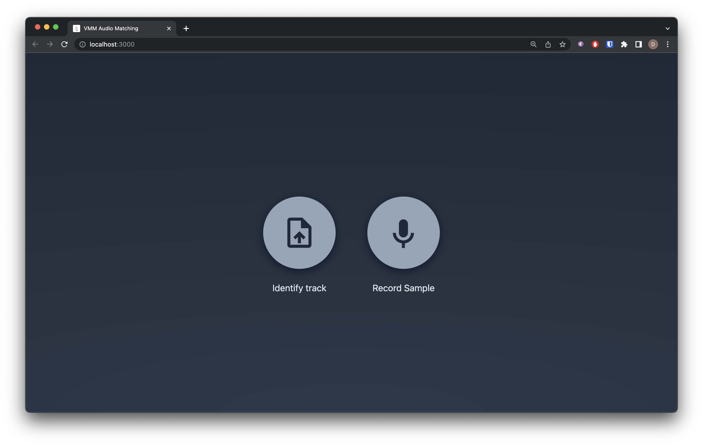
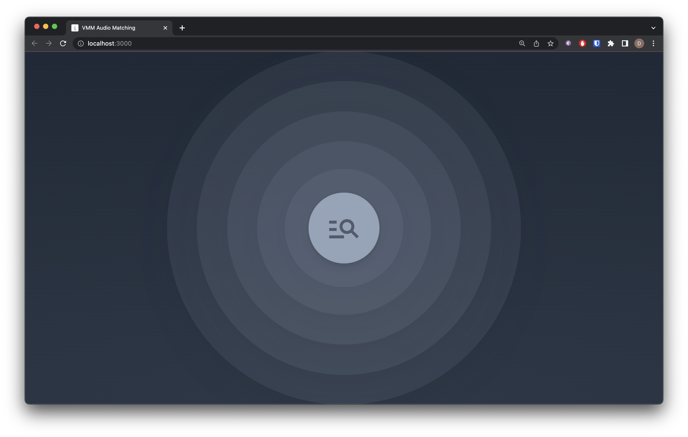
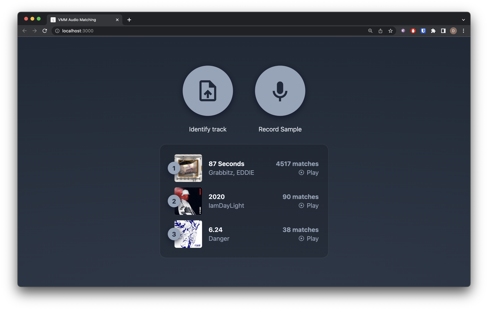

# Obecná audio podobnost (NI-VMM)

## Popis projektu
Projekt je zaměřen na implementaci podobnostní míry pro písničky. Aplikace by měla obsahovat databázi audio souborů. Uživatel se následně může dotázat vlastním audio dotazem (skrze webové rozhraní) do databáze a aplikace vrátí množinu podobných audio souborů v databázi. V rámci projektu je třeba
naimplementovat extrakci deskriptorů ze zvoleného typu audio souborů a navrhnout a implementovat na nich vlastní podobnostní míru.

Vstup: Audio soubor.

Výstup: Množina databázových audio souborů podobných vstupnímu audiu setříděných podle podobnosti s možností
jejich přehrání.

Aplikace by měla obsahovat části:
* Modul extrakce deskriptorů z audia
* Modul podobnostní míra pro porovnání dvojice audio souborů, tj. jejich deskriptorů
* Modul identifikace podobných databázových audio záznamů s ohledem na vstupní audio
* Webový interface

## Způsob řešení
Naše způsob extrakce deskriptorů a jejich následné porovnání je velmi inspirováno aplikací Shazam.

Nejprve si z audio souboru ve formátu wav sestrojíme matici krátkodobé Fourierovy transformace. Z té si následně vytáhneme jednotlivá pásma frekvencí (Hz): 0-40, 40-80, 80-120, 120-180, 180-300, 300-Inf. Z každého pásma pak vybereme nejhlasitější frekvence a zprůměrujeme jejich amplitudy. Vybereme však pouze frekvence, které mají větší amplitudu je průměrná pro celé pásmo.
 Tím dostaneme tzv. peak frequencies.

Z těchto "peak frequencies" sestrojíme za pomoci techniky "sliding window" hashe ve formátu `{"time": time, "hash": hash}`, kde `time` je čas mezi těmito špičkami. Tyto hashe následně uložíme do databáze.

Tento postup uděláme pro celý dataset při nasazení aplikace. Když pak přijde soubor na vstupu zpracujeme ho stejným způsobem a porovnáme jeho hashe s našimi v databázi, počet shodných hashů pak bereme jako míru podobnosti mezi vstupem a daným audiem z datasetu.

Tento algoritmus je detailně popsán i [zde](https://willdrevo.com/fingerprinting-and-audio-recognition-with-python/).

## Implementace
Celé porovnávní je implementováno v Pythonu za pomocí knihoven [librosa](https://librosa.org/doc/latest/index.html) pro práci s audiem a [NumPy](https://numpy.org/) pro matematické operace. Spouštění Python skriptů probíhá skrze Node.js funkci [child_process.spawn](https://nodejs.org/api/child_process.html#child_processspawncommand-args-options) pro spouštění procesů.

Webové rozhraní je React aplikace využívající [t3 stack](https://create.t3.gg/).

Ke spuštění je tedy potřeba mít nainstalovaný Python a v souboru [client/src/server/constants.ts](./client/src/server/constants.ts) specifikovat cestu k jeho executable.

## Příklad výstupu
Úvodní stránka: 

Porovnávání záznamů: 

Výsledky porovnávání: 

## Experimentální sekce
TODO

## Diskuze
TODO

## Závěr
TODO